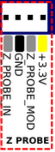
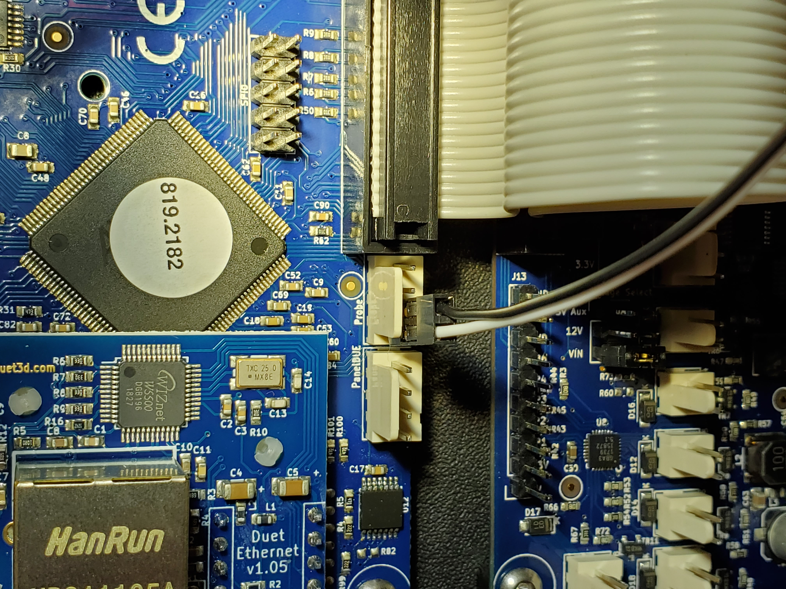
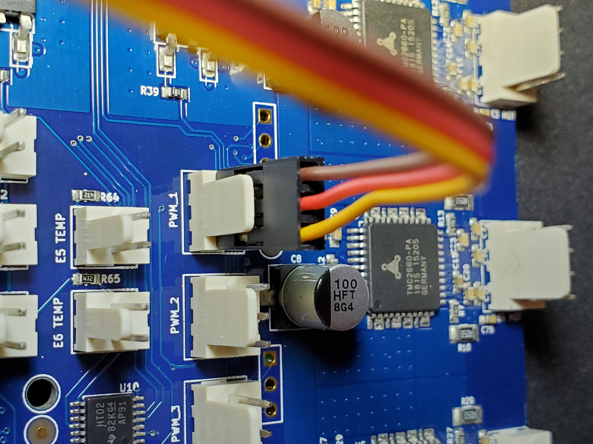

# BL-Touch
## Function
The ANTCLABS BL-Touch sensor has three basic parts:
1. A moving plastic pin with a magnet on top
1. A circuit board with hall-effect sensor and controller
1. A housing with a solenoid-like coil at the top to retract and hold the pin

## Connectors
The BL-Touch package includes a short wiring harness attached to the probe, which is not used with the Kit wiring harness.  It should be carefully unplugged from the BL-Touch before installation, as a longer 5-wire cable is included in the harness.

Because it emulates a microswitch and servo, the BL-Touch's wiring harness has five wires on two separate connectors:
1. The 2-pin Black & White wire connector is the probe endstop signal from BL-Touch, like a microswitch
1. The 3-pin connector is the control and power:

| Wire | Function |
| --- | ---|
| Brown | Ground |
| Orange | +5v |
| Yellow | Pulse-width servo control |

## Duet2 Connections
### Probe endstop contact
When facing the RailCore electronics panel and mounted Duet2, use the two pins on the **left side** of the "Z PROBE" 4-pin header.
The White lead goes on the far-left contact ("Z_PROBE_IN"), and black to GND.
Leave the two remaining pins on the right side unoccupied (Z_PROBE_MOD & +3.3V)




### Probe control signal
The Three-pin connector from BL-Touch is the control and power to the probe.  Connect this to the 3-pin connector on Duet for PWM1.
The Brown wire (ground) should be on the right pin, facing the connector.




Note that the kit wiring harness might be too short to reach this connector comfortably.  If you need to extend it, a three-wire Male-to-Female "servo extension" cable can be used.

## Duet Configuration
For these specific connectors, a configuration line like this in `config.g` might be appropriate:
```
; Z probe and compensation definition for BL-Touch
M558 P9 X0 Y0 Z1 F50 T6000 A5 S0.02 H5
G31 X3.0 Y40.8 Z2.104 P25
```
Note that this will need adjusting for your printer, as your BL-Touch offsets may not be the same.
The `G31` command **must come after** the `M558` definition in your `config.g`!

Here are the parameter arguments explained:
```
; P9: BL-Touch deploy/retract method
; F50: Probe Z speed in mm/min
; T6000: Travel speed between points
; A5 Maximum probes between each point to achieve uniform values
; S0.02 Tolerance when probing multiple times
; X0 Y0 Z1 Use this probe for Z axis endstop
; H3 5mm dive height (depends on how fast your BL Touch deploys)
```

## Measuring the X and Y offset between probe and nozzle
The `G31` parameter sets the offset between the specific probe point and the extruder nozzle.  This is factored into many calculations and probe patterns, and must be pretty close for your specific BL-Touch mount and hotend configuration.

You can use a ruler to find an approximate value until you complete printer setup, and refine it later.

To measure it accurately, we can use the printer to make a spot of plastic as a nozzle reference, then find the specific offset for the probe pin with that.

1. Bring your hot-end up to printing temperature, and wipe any ooze.
1. Home all axis.
1. Send the printer to X150 Y150 (center), using the Panel, Web interface, or `G1 X150 Y150 F2000` command.
1. Get very close to your print surface without contact
1. Extrude a very small amount of filament or just an ooze blog onto the surface, maybe with `G1 E3 F100`
1. Immediately lift the head away from the bed by climbing up 25mm in Z.  The idea is that by going straight up while the filament is hot, a distinct point will be seen on the bed, like a peak or pimple.  This is our X150/Y150 reference point.
1. Deploy the BL-Touch probe using your `deployprobe.g` macro or `M280 P3 S10`.  The pin should extend and stay extended.
1. Now use the panel or web interface to jog around the print bed, moving X and Y until your BL-Touch pin probe is directly over the plastic point.
1. Once positioned, your specific offset is the reported nozzle X/Y position distance from X150/Y150.  Use this value in your `G31` configuration.

