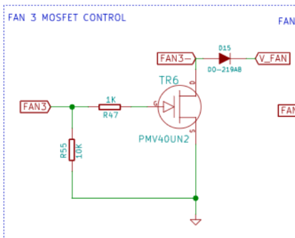

In the standard build, the RailCore's Duet2 board supports only 24v Fans but the Duex5 makes it very easy to add 12v Fans to your design.

Inexpensive 12v fans in 120mm, 80mm or other common computer-case size can be used to cool the electronics enclosure or printer interior, and the Duet firmware makes it easy to assign a thermostat for fan control.  The Duex5 provides a built-in 12v 2A switching regulator for LEDs or Fans, but it is not enabled by default.

# Enable the 12v Power Supply
Study the [Duex5 Connection Pinout](https://duet3d.dozuki.com/Wiki/Duex_wiring_diagrams) to identify the `INT 12V EN` jumper near the top-left of the board.
You must connect a jumper across these two pins to turn on the 12v power supply, as it is not enabled by default.

# Change the V_FAN power to 12v
By default, the Duex uses 24v for all `V_FAN` connections.  Locate `V_FAN JUMPER SELECT` and move the jumper from `VIN` (far left) to `12V` in the middle.  This changes all V_FAN PWM ports to use 12v.

# Connect 12v Fans
The 2-pin ports `FAN3` to `FAN8` can be used for 12v fans.

Note that these ports share a common +12v V_FAN supply which is powered at all times.  The negative or ground of the fan is modulated to adjust power for PWM.  Multiple fans can share positive power, but not a common ground!


# Enable Fans 
## Direct speed control
Each fan can be added as a controllable PWM fan with DWC (Web) control over speed:

```M106 P3 H-1 B0.2 I0 C"HappyFan" 	; FAN3```

Here the `P3` indicates the port, and other options configure the initial burst and name.

## Thermostat control
To use thermostatic control instead of direct PWM setting, you must first configure a Virtual Heater with a thermometer of interest.  For example, an extra NTC 100K added to E4 might be configured as Virtual Heater #106 this way:

```M305 P106 X5 T100000 B3950 R4700 C0 H0 L0 S"Chamber"```

Then the fan can use this Virtual Heater to adjust fan speed for a target temperature:

```M106 P3 H106 T60:62 L0.01 S1.00 B0.1 I0 C"Chamber Fan"```

Here the `H106` refers to the Virtual Heater assigned, and `P3`is the `FAN3` port on Duex.  The fan will turn on 1% speed at 60°C and ramp to maximum 100% speed by 62°C, which holds the temperature pretty even and close to 60.

For individual filaments, you could even adjust just the target temperature set-point with gcode, for example: `M106 P3 T45:47`.

Note that a fan configured for Thermostatic control will not appear in the web interface.  You can check its operation with `M106 P3` in this example.

# RPM Speed input

The Duex brings out pin `PB6` on the GPIO header for Fan RPM monitoring.  Unfortunately, this does not appear to be compatible with PWM speed control, and may be mismatched to the pules-per-RPM used by some computer fans.  Connecting `PB6` requires an inline diode for 3-wire fans, as described in the [Duet Fan documentation](https://duet3d.dozuki.com/Wiki/Connecting_and_configuring_fans).
